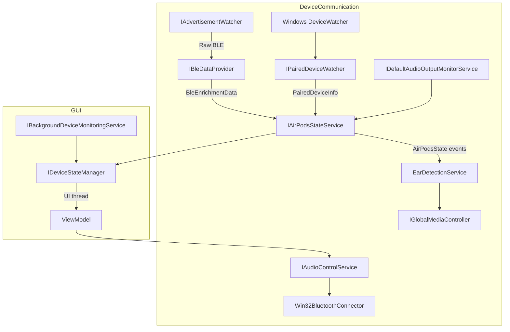

Read 

Read 

Read 

MinimalCLI shows a clear, straightforward pattern: enumerate paired AirPods, get connection/audio status, and connect/disconnect using `Win32BluetoothConnector`. Now reading the existing services in Services and Services to map overlaps and redundancies. 

Read 

Read 

Read 

Read 

Read 

Read 

Excellent—now reading the remaining services in Services and the GUI-specific ones to complete the overlap analysis. 

Read 

Read 

Read 

Read 

Read 

Now reading the GUI services to complete the picture. 

Read 

Read 

Read 

Read 

Let me also check the interfaces and any related event-args types. 

Read 

Read 

Read 

Now I have a complete picture. Let me summarize the findings and provide a revised, grounded plan.

---

# 🔍 Comprehensive Review: Existing Services vs. Proposed Plan

## Current Architecture Inventory

### DeviceCommunication/Services (Core Layer)
| Service | Interface | Purpose | Event-Driven? | Notes |
|---------|-----------|---------|---------------|-------|
| `AirPodsStateService` | `IAirPodsStateService` | **Unified state aggregator** – combines paired device + BLE data | ✅ Yes | Already does correlation via `ProductId`. This is the hub. |
| `BleDataProvider` | `IBleDataProvider` | Parses BLE advertisements → `BleEnrichmentData` | ✅ Yes | Lean, event-based, correctly scoped. |
| `PairedDeviceWatcher` | `IPairedDeviceWatcher` | Watches Windows `DeviceWatcher` for paired device changes | ✅ Yes | Event-based, no polling. |
| `PairedDeviceLookupService` | `IPairedDeviceLookupService` | Cached lookup by ProductId | ❌ Polling-style cache | **Redundant** – `PairedDeviceWatcher` already maintains live state. |
| `SimpleAirPodsDiscoveryService` | `IAirPodsDiscoveryService` | BLE discovery + paired lookup | ❌ Mixed | **Redundant** – duplicates `BleDataProvider` + `PairedDeviceLookupService`. |
| `BluetoothConnectionService` | `IBluetoothConnectionService` | Connect/disconnect by device ID | N/A (command) | Wraps `Win32BluetoothConnector`. Keep. |
| `Win32BluetoothConnector` | (none) | Low-level Win32 P/Invoke for audio profiles | N/A | Keep – required for connect/disconnect. |
| `DefaultAudioOutputMonitorService` | `IDefaultAudioOutputMonitorService` | Monitors default audio output changes | ✅ Yes | Event-based via `MediaDevice.DefaultAudioRenderDeviceChanged`. |
| `EarDetectionService` | (none) | Auto-pause/resume on ear removal | ✅ Yes | Consumes `IAirPodsStateService`. Keep. |
| `GlobalMediaController` | `IGlobalMediaController` | Pause/play system media | N/A (command) | Keep. |
| `BluetoothDeviceHelper` | (none) | Utility helpers | N/A | Needs review. |
| `AirPodsDeviceAggregator` | (none) | **Empty file** | N/A | Remove. |

### GUI/Services (UI Layer)
| Service | Interface | Purpose | Notes |
|---------|-----------|---------|-------|
| `DeviceStateManager` | `IDeviceStateManager` | Wraps `IAirPodsStateService`, marshals to UI thread | Thin wrapper – keeps UI decoupled from core. Keep. |
| `BackgroundDeviceMonitoringService` | `IBackgroundDeviceMonitoringService` | Tracks notification state per device | Consumes `IDeviceStateManager`. Keep. |
| `TrayIconService` | (none) | System tray | Keep. |

### Models (DeviceCommunication/Models)
| Model | Purpose | Notes |
|-------|---------|-------|
| `PairedDeviceInfo` | Paired device record from Windows | Minimal, correct. |
| `AirPodsDeviceInfo` | BLE-centric discovery record | **Overlaps** with `AirPodsState`. Candidate for removal. |
| `AirPodsState` | Unified state (paired + BLE) | Authoritative projection. Keep and extend. |
| `BleEnrichmentData` | BLE-only enrichment DTO | Clean, scoped. Keep. |

---

## Key Findings

### ✅ What's Already Good
1. **`AirPodsStateService`** is already the correlation hub – it subscribes to `IPairedDeviceWatcher` and `IBleDataProvider`, merges by `ProductId`, and emits `StateChanged` events.
2. **`BleDataProvider`** is clean and event-driven.
3. **`PairedDeviceWatcher`** uses Windows `DeviceWatcher` events (no polling).
4. **`DefaultAudioOutputMonitorService`** uses `MediaDevice.DefaultAudioRenderDeviceChanged` (event-based).
5. **`EarDetectionService`** consumes unified state and controls media.
6. **GUI layer** correctly wraps core services and marshals to UI thread.

### ⚠️ Redundancies & Overlaps
1. **`SimpleAirPodsDiscoveryService`** duplicates `BleDataProvider` + `PairedDeviceLookupService`. Used by nothing in the main path. **Remove.**
2. **`PairedDeviceLookupService`** is a cache-based lookup that duplicates `PairedDeviceWatcher.GetByProductId()`. **Remove.**
3. **`IAirPodsDiscoveryService`** interface is unused by the main flow. **Remove.**
4. **`AirPodsDeviceInfo`** model overlaps with `AirPodsState`. **Consolidate or remove.**
5. **`AirPodsDeviceAggregator.cs`** is empty. **Remove.**
6. **`BluetoothConnectionService`** wraps `Win32BluetoothConnector` but adds little value (caches `BluetoothDevice` references). Consider inlining into `IAudioControlService` or keeping as-is.

### 🔧 Missing Pieces (from plan)
1. **`IAudioControlService`** interface – currently `BluetoothConnectionService` + `Win32BluetoothConnector` serve this role but lack a clean interface for mocking.
2. **`IAudioPolicyProvider`** – ear removal policy is hardcoded in `EarDetectionService`. Should be configurable.
3. **Audio route fallback** – when disconnecting, no logic to revert to previous default output.

---

## Revised Plan

### Phase 1: Cleanup (Remove Redundancies)
| Action | File(s) |
|--------|---------|
| Delete | SimpleAirPodsDiscoveryService.cs, `IAirPodsDiscoveryService.cs` |
| Delete | PairedDeviceLookupService.cs, `IPairedDeviceLookupService.cs` |
| Delete | `AirPodsDeviceAggregator.cs` (empty) |
| Delete | AirPodsDeviceInfo.cs (use `AirPodsState` everywhere) |
| Update | Remove usages of deleted types from remaining code |

### Phase 2: Interface Alignment
| Action | Details |
|--------|---------|
| Create | `IAudioControlService` interface exposing `ConnectAsync`, `DisconnectAsync`, `IsDefaultAudioOutputAsync` |
| Implement | `AudioControlService` wrapping `Win32BluetoothConnector` (or rename `BluetoothConnectionService`) |
| Create | `IAudioPolicyProvider` interface with `AutoPausePolicy` enum (`Disabled`, `OneRemoved`, `BothRemoved`) |
| Implement | `AudioPolicyProvider` with default config; wire into `EarDetectionService` |

### Phase 3: State Service Refinement
| Action | Details |
|--------|---------|
| Extend | `AirPodsState` with `PreviousAudioOutputId` for route fallback |
| Add | Optional debounce in `BleDataProvider` (currently debounce is in `DeviceStateManager`) – consider moving to core |
| Add | Structured logging via `ILogger<T>` injection (optional) |

### Phase 4: DI Registration
| Action | Details |
|--------|---------|
| Update | CLI Program.cs to register services via DI (currently uses `new`) |
| Ensure | GUI `App.xaml.cs` registers all interfaces for testability |
| Create | Test doubles / mocks for `IBleDataProvider`, `IPairedDeviceWatcher`, `IAudioControlService` |

### Phase 5: Testing
| Action | Details |
|--------|---------|
| Add | Unit tests for `AirPodsStateService` correlation logic |
| Add | Integration tests with fake BLE/paired event sequences |
| Validate | MinimalCLI works with refactored services |

---

## Mermaid: Target Architecture (Post-Cleanup)

---

## Checklist

### Cleanup
- [ ] Delete SimpleAirPodsDiscoveryService.cs + interface
- [ ] Delete PairedDeviceLookupService.cs + interface
- [ ] Delete `AirPodsDeviceAggregator.cs`
- [ ] Delete AirPodsDeviceInfo.cs
- [ ] Remove all usages of deleted types

### Interfaces
- [ ] Create `IAudioControlService`
- [ ] Create `IAudioPolicyProvider`
- [ ] Implement `AudioControlService`
- [ ] Implement `AudioPolicyProvider`
- [ ] Wire into DI

### State
- [ ] Extend `AirPodsState` if needed (e.g., `PreviousAudioOutputId`)
- [ ] Move debounce to `BleDataProvider` (optional)

### Testing
- [ ] Unit tests for `AirPodsStateService`
- [ ] Test doubles for core interfaces
- [ ] Validate MinimalCLI

---

This revised plan builds on the existing solid foundation, removes redundant code, and fills the remaining gaps (interfaces for mocking, policy abstraction). Ready to proceed with implementation when you give the go-ahead.